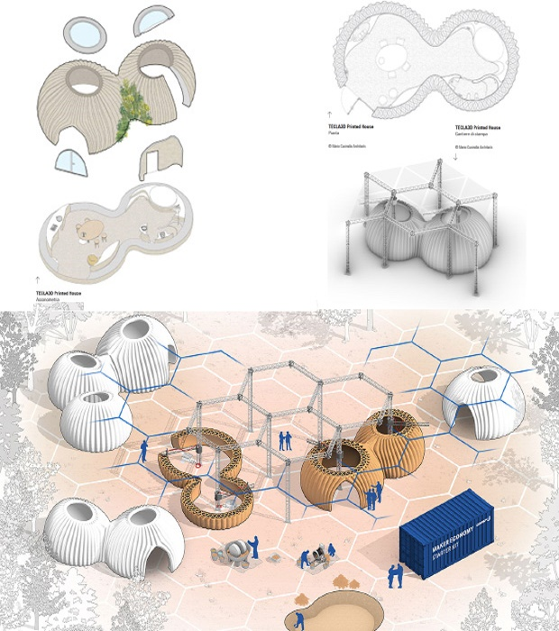

# An environmentally sustainable house 3D-printed from clay, water, and rice husk fibers

3D-printing is so tightly integrated into our lives that no one is surprised when in different parts of the world appear homes and entire settlements built using innovative technology. Most recently, the Italian company WASP with its partner Mario Cucinella Architects presented its vision of sustainable housing - a dome-shaped house TECLA, printed with clay, water and rice husk fibers.

Three years ago the company WASP, which specializes in the development of technology and production of 3D printers, together with Mario Cucinella Architects presented the concept of sustainable housing model. And only now the partners have managed to implement a unique project which has been named TECLA (technology and clay). The unusual domed house was printed in just 200 hours in the small town of Massa Lombarda near Bologna (Italy).

Noteworthy: The company's name WASP, which stands for "advanced rescue project in the world," was inspired by the Potter's wasp, which builds its nest from material extracted from the natural environment. Since 2012, the Italian company has been developing building processes based on the principles of circular economy and production from natural materials. TECLA's development is no exception, through which the authors hope to connect the theme of ancient timeless houses with the advanced technologies of the 21st century. In addition, the project responds to the requirements of the global problem of climate change and the need for efficient and fast methods of sustainable construction, which is especially relevant in the context of the devastation during natural disasters and the provision of affordable housing for the poor or refugees.

According to the editorial: the uniqueness of the new project is that the walls are not used expensive concrete mortar and synthetic materials, but only natural raw materials - soil or clay, water, rice husk fibers and 5% of the binder (additives are adapted to the raw materials of the area). This technology will greatly simplify construction, especially in regions where there are problems with delivery and with the cost of materials or concrete mixes for 3D-printers.

## The main advantage of the technology used in the TECLA model is:
- environmental sustainability;
- complete safety for the environment and people;
- wasteless production;
- construction time (if compared to traditional processes);
- does not require the cost of delivering materials to the construction site.

